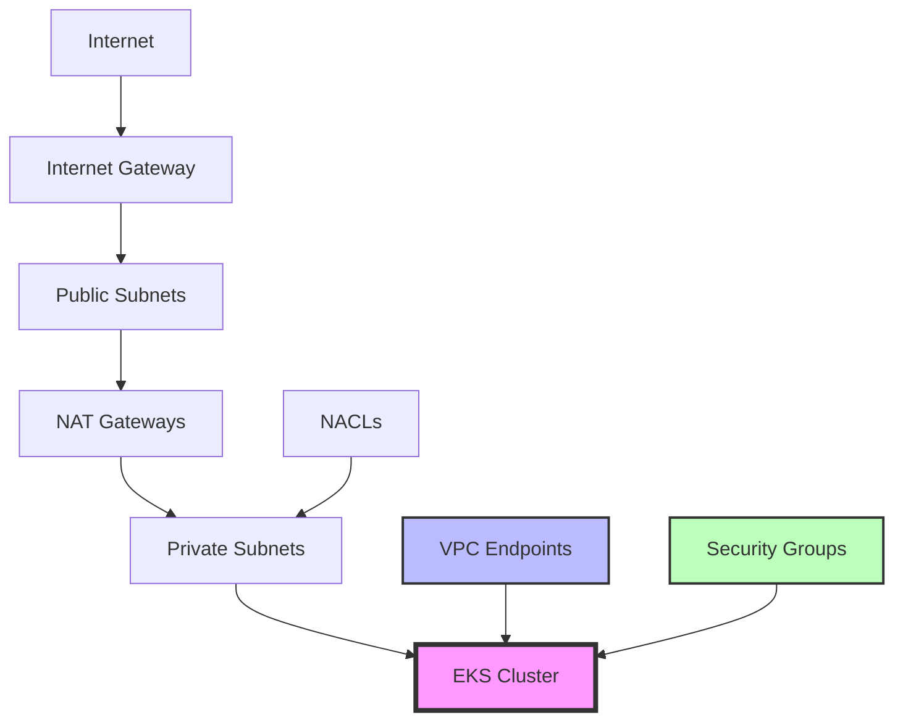

# AWS EKS Landing Zone - Terraform Implementation

This directory contains Terraform configuration for deploying a production-ready, secure AWS EKS landing zone equivalent to the Azure AKS Landing Zone using Azure Verified Modules.

## Architecture Overview

### Infrastructure Components

```
┌─ Internet (External Traffic)
│
├─ VPC (10.0.0.0/16)
│  │
│  ├─ Public Subnets (10.0.10.0/24, 10.0.11.0/24)
│  │  ├─ NAT Gateways (HA across AZs)
│  │  └─ Internet Gateway
│  │
│  ├─ Private Subnets (10.0.1.0/24, 10.0.2.0/24)
│  │  ├─ EKS Cluster (Private API endpoint)
│  │  ├─ System Node Pool (t3.medium, 1-3 nodes)
│  │  └─ User Node Pool (m5.large, 2-10 nodes, autoscaling)
│  │
│  └─ VPC Endpoints (10.0.20.0/24, 10.0.21.0/24)
│     ├─ ECR API/DKR, S3, EKS, Secrets Manager
│     ├─ CloudWatch Logs, STS, SSM, Monitoring
│     └─ EC2, AutoScaling (for cluster operations)
│
├─ Container Registry (ECR)
│  ├─ Application Repository (mutable tags)
│  ├─ Base Images Repository (immutable tags)
│  └─ KMS encryption + vulnerability scanning
│
├─ Secrets & Configuration
│  ├─ AWS Secrets Manager (database, API keys, TLS certs)
│  ├─ SSM Parameter Store (cluster config, monitoring)
│  └─ KMS keys for all encryption needs
│
├─ Monitoring & Observability
│  ├─ CloudWatch Log Groups (cluster, containers, applications)
│  ├─ CloudWatch Container Insights
│  ├─ Custom dashboards and alarms
│  └─ S3 bucket for cluster artifacts
│
└─ IAM & Security
   ├─ EKS cluster service role
   ├─ Node group instance roles
   └─ IRSA roles (Load Balancer Controller, EBS CSI,
      Cluster Autoscaler, CloudWatch Observability)
```

### Key Features

#### Zero Trust Security Model
- **Private-by-Default**: EKS API server only accessible via private endpoint
- **VPC Endpoints**: All AWS service communication stays within AWS backbone
- **Security Groups**: Least-privilege network access controls
- **KMS Encryption**: All data encrypted at rest with customer-managed keys
- **IRSA**: No static credentials, all workload authentication via IAM roles

#### High Availability & Scalability
- **Multi-AZ**: Resources distributed across availability zones
- **Auto Scaling**: Node groups scale based on demand (2-10 nodes)
- **NAT Gateway HA**: One NAT Gateway per AZ for redundancy
- **EKS Add-ons**: Managed CoreDNS, VPC CNI, EBS CSI driver

#### Operational Excellence
- **CloudWatch Integration**: Comprehensive logging and monitoring
- **Infrastructure as Code**: Fully declarative, version-controlled
- **Automated Deployment**: One-command deployment with validation
- **Disaster Recovery**: State stored remotely, complete reproducibility

## File Structure

```
terraform/
├── terraform.tf              # Provider requirements and backend config
├── providers.tf              # Provider configurations
├── variables.tf              # Input variables with validation
├── locals.tf                 # Local values and computed configurations
├── data.tf                   # Data sources for AWS resources
├── vpc.tf                    # VPC, subnets, security groups, VPC endpoints
├── kms.tf                    # KMS keys for encryption
├── eks.tf                   # EKS cluster, node groups, launch templates
├── iam.tf                   # IAM roles, policies, IRSA configurations
├── ecr.tf                   # Container registry repositories
├── secrets.tf               # Secrets Manager and SSM parameters
├── monitoring.tf            # CloudWatch resources, S3 bucket, SNS
├── outputs.tf               # Output values for external reference
├── terraform.tfvars.example # Example variable values
├── templates/
│   └── user_data.sh         # Node initialization script
└── README.md                # This file
```

## Terraform Modules Used

### External Modules
- **terraform-aws-modules/vpc/aws** (~6.0): Industry-standard VPC module
- **cloudposse/eks-cluster/aws** (~4.0): Production-ready EKS cluster
- **terraform-aws-modules/iam/aws** (~5.0): IRSA role management

### Module Selection Rationale
- **Proven in Production**: Modules with millions of downloads
- **Active Maintenance**: Regular updates and security patches
- **Community Support**: Large user base and extensive documentation
- **Security Focus**: Built-in security best practices

## Prerequisites

### Required Tools
- **Terraform** >= 1.9.0 ([Install Guide](https://learn.hashicorp.com/tutorials/terraform/install-cli))
- **AWS CLI** >= 2.0 ([Install Guide](https://docs.aws.amazon.com/cli/latest/userguide/install-cliv2.html))
- **kubectl** >= 1.28 ([Install Guide](https://kubernetes.io/docs/tasks/tools/))
- **jq** (for JSON processing in scripts)

### AWS Permissions
The deploying IAM user/role requires these permissions:
```json
{
  "Version": "2012-10-17",
  "Statement": [
    {
      "Effect": "Allow",
      "Action": [
        "ec2:*",
        "eks:*",
        "ecr:*",
        "iam:*",
        "logs:*",
        "cloudwatch:*",
        "sns:*",
        "s3:*",
        "secretsmanager:*",
        "ssm:*",
        "kms:*"
      ],
      "Resource": "*"
    }
  ]
}
```

### AWS Configuration
```bash
# Configure AWS CLI
aws configure

# Verify configuration
aws sts get-caller-identity
aws eks describe-cluster --name test --region us-east-1 || echo "CLI configured correctly"
```

## Deployment Guide

### Quick Start

```bash
# 1. Clone and navigate to terraform directory
cd aws-eks-landing-zone/terraform

# 2. Copy example variables
cp terraform.tfvars.example terraform.tfvars

# 3. Edit variables for your environment
vim terraform.tfvars

# 4. Deploy with automated script
../scripts/deploy-terraform.sh -e prod -c acme-eks -r us-west-2
```

### Manual Deployment

```bash
# 1. Initialize Terraform
terraform init

# 2. Create execution plan
terraform plan -var-file="terraform.tfvars"

# 3. Review plan and apply
terraform apply -var-file="terraform.tfvars"

# 4. Configure kubectl access
aws eks update-kubeconfig --region us-west-2 --name acme-eks-prod

# 5. Verify cluster access
kubectl get nodes
kubectl get pods -A
```

### Environment-Specific Deployment

#### Development Environment
```hcl
# terraform.tfvars
environment = "dev"
cluster_name = "dev-eks"
aws_region = "us-east-1"

# Cost-optimized settings
system_node_instance_types = ["t3.small"]
user_node_instance_types = ["t3.medium"]
system_node_min_size = 1
system_node_max_size = 2
user_node_min_size = 1
user_node_max_size = 5

enable_vpc_flow_logs = false
log_retention_days = 7
```

#### Production Environment
```hcl
# terraform.tfvars
environment = "prod"
cluster_name = "production-eks"
aws_region = "us-west-2"

# Production-ready settings
system_node_instance_types = ["t3.large"]
user_node_instance_types = ["m5.xlarge", "m5.2xlarge"]
system_node_min_size = 3
system_node_max_size = 6
user_node_min_size = 3
user_node_max_size = 20

enable_vpc_flow_logs = true
log_retention_days = 90
enable_container_insights = true

additional_tags = {
  Environment = "production"
  CriticalityLevel = "high"
  BackupRequired = "true"
  ComplianceScope = "SOC2"
}
```

## Configuration Options

### Core Variables

| Variable | Type | Default | Description |
|----------|------|---------|-------------|
| `environment` | string | "dev" | Environment name (dev, staging, prod) |
| `cluster_name` | string | "eks-cluster" | EKS cluster name |
| `aws_region` | string | "us-east-1" | AWS deployment region |
| `kubernetes_version` | string | "1.31" | Kubernetes version |

### Network Configuration

| Variable | Type | Default | Description |
|----------|------|---------|-------------|
| `vpc_cidr` | string | "10.0.0.0/16" | VPC CIDR block |
| `private_subnet_cidrs` | list(string) | ["10.0.1.0/24", "10.0.2.0/24"] | Private subnet CIDRs |
| `public_subnet_cidrs` | list(string) | ["10.0.10.0/24", "10.0.11.0/24"] | Public subnet CIDRs |
| `enable_private_endpoint` | bool | true | Enable private API endpoint |
| `enable_public_endpoint` | bool | false | Enable public API endpoint |

### Node Group Configuration

| Variable | Type | Default | Description |
|----------|------|---------|-------------|
| `system_node_instance_types` | list(string) | ["t3.medium"] | System node instance types |
| `user_node_instance_types` | list(string) | ["m5.large"] | User node instance types |
| `system_node_min_size` | number | 1 | System nodes minimum count |
| `system_node_max_size` | number | 3 | System nodes maximum count |
| `user_node_min_size` | number | 2 | User nodes minimum count |
| `user_node_max_size` | number | 10 | User nodes maximum count |

### Add-ons Configuration

| Variable | Type | Default | Description |
|----------|------|---------|-------------|
| `enable_aws_load_balancer_controller` | bool | true | Deploy AWS Load Balancer Controller |
| `enable_cluster_autoscaler` | bool | true | Deploy Cluster Autoscaler |
| `enable_ebs_csi_driver` | bool | true | Deploy EBS CSI Driver |
| `enable_container_insights` | bool | true | Enable CloudWatch Container Insights |

## Security Configuration

### Network Security

The infrastructure implements defense-in-depth network security:



#### Security Groups
- **Cluster Security Group**: Minimal ingress (443 from nodes only)
- **Node Security Group**: Node-to-node communication + cluster access
- **VPC Endpoints Security Group**: HTTPS from VPC CIDR only

#### Network Policies
- Cluster uses AWS VPC CNI with security group policies
- Optional: Calico for advanced network policies
- Default deny-all with explicit allow rules

### Identity and Access Management

#### IRSA (IAM Roles for Service Accounts)
```hcl
# Automatic IRSA role creation for supported add-ons
module "load_balancer_controller_irsa_role" {
  source = "terraform-aws-modules/iam/aws//modules/iam-role-for-service-accounts-eks"

  role_name = "${local.name_prefix}-aws-load-balancer-controller"
  attach_load_balancer_controller_policy = true

  oidc_providers = {
    main = {
      provider_arn = module.eks_cluster.eks_cluster_identity_oidc_issuer_arn
      namespace_service_accounts = ["kube-system:aws-load-balancer-controller"]
    }
  }
}
```

#### Service Account Annotations
```yaml
# Example service account with IRSA
apiVersion: v1
kind: ServiceAccount
metadata:
  name: aws-load-balancer-controller
  namespace: kube-system
  annotations:
    eks.amazonaws.com/role-arn: arn:aws:iam::123456789012:role/eks-cluster-dev-aws-load-balancer-controller
```

### Encryption

#### KMS Key Management
- **Dedicated keys** for each service (EKS, ECR, Secrets Manager, CloudWatch)
- **Automatic key rotation** enabled
- **IAM-based access control** to keys
- **Cross-service access** properly configured

#### Data Protection
- **EKS Secrets**: Encrypted with customer-managed KMS key
- **ECR Images**: Encrypted at rest with KMS
- **CloudWatch Logs**: Encrypted with service-specific key
- **S3 Artifacts**: AES-256 encryption
- **EBS Volumes**: Encrypted by default

## Monitoring and Observability

### CloudWatch Integration

#### Log Groups
```
/aws/eks/${cluster-name}/cluster     # EKS control plane logs
/aws/eks/${cluster-name}/containers  # Container stdout/stderr
/aws/eks/${cluster-name}/applications # Application-specific logs
/aws/vpc/${cluster-name}/flowlogs    # VPC flow logs (optional)
```

#### Container Insights
- **Automatic metrics collection** from nodes and pods
- **Performance monitoring** for cluster and workloads
- **Resource utilization** tracking and alerting
- **Integration with CloudWatch dashboards**

### Alerting

#### Default CloudWatch Alarms
- **High CPU utilization** on node groups (>80%)
- **EKS API server errors** (>10 failed requests)
- **Node group scaling events**
- **ECR push/pull failures**

#### SNS Integration
```hcl
# Alerts sent to SNS topic for external integration
resource "aws_sns_topic" "alerts" {
  name = "${local.name_prefix}-alerts"
}

# Add email subscription
resource "aws_sns_topic_subscription" "email_alerts" {
  topic_arn = aws_sns_topic.alerts.arn
  protocol  = "email"
  endpoint  = "platform-team@company.com"
}
```

### Dashboards

#### EKS Cluster Dashboard
- **API server metrics** (request count, latency, errors)
- **Node performance** (CPU, memory, network, disk)
- **Pod metrics** (running, pending, failed)
- **Recent error logs** from cluster and applications

#### Cost Optimization Dashboard
- **Instance type utilization**
- **Auto Scaling activity**
- **Storage usage** (EBS, ECR)
- **Data transfer costs** (NAT Gateway usage)

## Operations Guide

### Day 1 Operations

#### Initial Cluster Setup
```bash
# 1. Deploy base infrastructure
terraform apply

# 2. Configure kubectl
aws eks update-kubeconfig --region us-west-2 --name acme-eks-prod

# 3. Verify cluster health
kubectl get nodes
kubectl get pods -A
kubectl top nodes

# 4. Install additional tooling
kubectl apply -f https://raw.githubusercontent.com/kubernetes/dashboard/v2.7.0/aio/deploy/recommended.yaml
```

#### Application Deployment
```bash
# 1. Configure ECR access
aws ecr get-login-password --region us-west-2 | docker login --username AWS --password-stdin 123456789012.dkr.ecr.us-west-2.amazonaws.com

# 2. Build and push container
docker build -t my-app .
docker tag my-app:latest 123456789012.dkr.ecr.us-west-2.amazonaws.com/acme-eks-prod:latest
docker push 123456789012.dkr.ecr.us-west-2.amazonaws.com/acme-eks-prod:latest

# 3. Deploy to Kubernetes
kubectl apply -f k8s-manifests/
```

### Day 2 Operations

#### Cluster Updates
```bash
# 1. Update cluster version
terraform apply -var="kubernetes_version=1.32"

# 2. Update node groups (rolling update)
terraform apply

# 3. Update add-ons
kubectl set image deployment/aws-load-balancer-controller \
  controller=amazon/aws-load-balancer-controller:v2.8.1 \
  -n kube-system
```

#### Scaling Operations
```bash
# 1. Scale node group manually
aws eks update-nodegroup-config \
  --cluster-name acme-eks-prod \
  --nodegroup-name acme-eks-prod-user \
  --scaling-config minSize=5,maxSize=20,desiredSize=8

# 2. Scale deployment
kubectl scale deployment my-app --replicas=10

# 3. Configure HPA
kubectl autoscale deployment my-app --cpu-percent=70 --min=3 --max=20
```

#### Backup and Recovery
```bash
# 1. Backup cluster configuration
kubectl get all -A -o yaml > cluster-backup-$(date +%Y%m%d).yaml

# 2. Export secrets (for migration)
kubectl get secrets -A -o yaml > secrets-backup-$(date +%Y%m%d).yaml

# 3. Velero backup (if installed)
velero backup create cluster-backup-$(date +%Y%m%d)
```

### Troubleshooting

#### Common Issues

**1. Node Startup Issues**
```bash
# Check node status
kubectl describe nodes

# View kubelet logs
aws ssm start-session --target i-1234567890abcdef0
sudo journalctl -u kubelet -f

# Check user data execution
sudo cat /var/log/cloud-init-output.log
```

**2. Pod Scheduling Issues**
```bash
# Check pod events
kubectl describe pod <pod-name>

# View cluster events
kubectl get events --sort-by=.metadata.creationTimestamp

# Check node capacity
kubectl describe nodes | grep -A 5 "Capacity\|Allocatable"
```

**3. Networking Issues**
```bash
# Test DNS resolution
kubectl run -it --rm debug --image=busybox --restart=Never -- nslookup kubernetes.default

# Check VPC CNI logs
kubectl logs -n kube-system -l app=aws-node

# Test connectivity to AWS services
kubectl run -it --rm debug --image=amazonlinux --restart=Never -- aws sts get-caller-identity
```

**4. IRSA Issues**
```bash
# Check service account annotations
kubectl describe sa <service-account> -n <namespace>

# Verify OIDC provider
aws eks describe-cluster --name <cluster-name> --query cluster.identity.oidc.issuer

# Test role assumption
aws sts assume-role-with-web-identity \
  --role-arn <role-arn> \
  --role-session-name test \
  --web-identity-token $(cat /var/run/secrets/eks.amazonaws.com/serviceaccount/token)
```

#### Recovery Procedures

**Cluster Recovery**
```bash
# 1. Check cluster status
aws eks describe-cluster --name <cluster-name>

# 2. Restart cluster if needed (control plane)
# Note: This is typically handled by AWS automatically

# 3. Replace unhealthy nodes
aws eks update-nodegroup-config --cluster-name <cluster-name> --nodegroup-name <nodegroup-name> --update-config maxUnavailable=1
```

**Node Group Recovery**
```bash
# 1. Drain problem nodes
kubectl drain <node-name> --ignore-daemonsets --delete-emptydir-data

# 2. Terminate instances (Auto Scaling will replace)
aws autoscaling terminate-instance-in-auto-scaling-group \
  --instance-id i-1234567890abcdef0 \
  --should-decrement-desired-capacity

# 3. Verify replacement
kubectl get nodes
```

## Cost Optimization

### Right-Sizing Recommendations

#### Development Environment
```hcl
# Minimal setup for development
system_node_instance_types = ["t3.small"]      # $15/month per node
user_node_instance_types   = ["t3.medium"]     # $30/month per node
user_node_min_size        = 1
user_node_max_size        = 3

# Estimated monthly cost: $100-150
```

#### Staging Environment
```hcl
# Scaled-down production replica
system_node_instance_types = ["t3.medium"]     # $30/month per node
user_node_instance_types   = ["m5.large"]      # $70/month per node
user_node_min_size        = 2
user_node_max_size        = 6

# Estimated monthly cost: $300-500
```

#### Production Environment
```hcl
# High availability and performance
system_node_instance_types = ["t3.large"]      # $60/month per node
user_node_instance_types   = ["m5.xlarge", "m5.2xlarge"]  # $140-280/month per node
user_node_min_size        = 3
user_node_max_size        = 15

# Estimated monthly cost: $800-1500
```

### Cost Reduction Strategies

#### 1. Reserved Instances
```bash
# Purchase 1-year reserved instances for production
aws ec2 purchase-reserved-instances-offering \
  --reserved-instances-offering-id <offering-id> \
  --instance-count 3
```

#### 2. Spot Instances (Non-Production)
```hcl
# Add spot instance support to node group
resource "aws_eks_node_group" "spot" {
  capacity_type   = "SPOT"
  instance_types  = ["m5.large", "m5.xlarge", "m4.large"]

  scaling_config {
    desired_size = 2
    max_size     = 10
    min_size     = 0
  }
}
```

#### 3. Cluster Autoscaler Optimization
```yaml
# Configure aggressive scale-down
apiVersion: v1
kind: ConfigMap
metadata:
  name: cluster-autoscaler-status
  namespace: kube-system
data:
  cluster-autoscaler.status: |
    scale-down-delay-after-add: 2m
    scale-down-unneeded-time: 2m
    scale-down-delay-after-failure: 1m
```

## Compliance and Security

### Security Benchmarks

#### CIS Kubernetes Benchmark
- **✓ Control Plane Security**: Private API endpoint, encryption at rest
- **✓ Worker Node Security**: Hardened AMIs, restricted SSH access
- **✓ Network Policies**: Security groups + VPC CNI policies
- **✓ RBAC**: IAM integration with least privilege
- **✓ Secrets Management**: External secrets via AWS Secrets Manager

#### AWS Security Hub
```bash
# Enable Security Hub
aws securityhub enable-security-hub

# View EKS-specific findings
aws securityhub get-findings \
  --filters ProductArn=[{Value="arn:aws:securityhub:*:*:product/*/eks"}]
```

### Compliance Frameworks

#### SOC 2 Type II
- **✓ Security**: Encryption, access controls, monitoring
- **✓ Availability**: Multi-AZ, auto-scaling, health checks
- **✓ Processing Integrity**: Immutable infrastructure, audit logs
- **✓ Confidentiality**: Private networking, secrets management
- **✓ Privacy**: Data isolation, access logging

#### GDPR Compliance
- **Data Protection by Design**: Encryption, access controls
- **Right to be Forgotten**: Automated data deletion capabilities
- **Data Minimization**: Least-privilege access, log retention policies
- **Audit Trail**: CloudTrail integration for all data access

#### PCI DSS (Additional Controls Required)
- **Network Segmentation**: Additional security groups and NACLs
- **Regular Scanning**: Vulnerability assessments, penetration testing
- **Access Controls**: Strong authentication, regular access reviews
- **Encryption**: Enhanced key management, certificate rotation

### Audit and Compliance Automation

#### AWS Config Rules
```hcl
# Example: Ensure EKS clusters are not publicly accessible
resource "aws_config_config_rule" "eks_private_endpoint" {
  name = "eks-cluster-private-endpoint-enabled"

  source {
    owner             = "AWS"
    source_identifier = "EKS_ENDPOINT_NO_PUBLIC_ACCESS"
  }

  depends_on = [aws_config_configuration_recorder.recorder]
}
```

#### CloudWatch Compliance Metrics
```hcl
# Monitor compliance status
resource "aws_cloudwatch_metric_alarm" "compliance_violations" {
  alarm_name          = "compliance-violations"
  comparison_operator = "GreaterThanThreshold"
  evaluation_periods  = "1"
  metric_name         = "ComplianceByConfigRule"
  namespace           = "AWS/Config"
  period              = "300"
  statistic           = "Average"
  threshold           = "0"
  alarm_description   = "This metric monitors compliance violations"
}
```

## Disaster Recovery

### Backup Strategy

#### Infrastructure Backup
```bash
# 1. Terraform state backup (automated via backend)
terraform state pull > cluster-state-backup-$(date +%Y%m%d).json

# 2. Kubernetes manifests backup
kubectl get all -A -o yaml > k8s-resources-backup-$(date +%Y%m%d).yaml

# 3. Secrets backup (encrypted)
kubectl get secrets -A -o yaml | gpg --encrypt -r admin@company.com > secrets-backup-$(date +%Y%m%d).gpg
```

#### Cross-Region Replication
```hcl
# ECR cross-region replication
resource "aws_ecr_replication_configuration" "main" {
  replication_configuration {
    rule {
      destination {
        region      = "us-east-1"
        registry_id = data.aws_caller_identity.current.account_id
      }
    }
  }
}

# S3 cross-region replication
resource "aws_s3_bucket_replication_configuration" "replication" {
  role   = aws_iam_role.replication.arn
  bucket = aws_s3_bucket.cluster_artifacts.id

  rule {
    id     = "backup-replication"
    status = "Enabled"

    destination {
      bucket        = aws_s3_bucket.backup.arn
      storage_class = "STANDARD_IA"
    }
  }
}
```

### Recovery Procedures

#### Complete Cluster Recreation
```bash
# 1. Deploy infrastructure in new region
terraform apply -var="aws_region=us-east-1"

# 2. Restore ECR images
aws ecr describe-repositories --region us-west-2 --query 'repositories[].repositoryName' --output text | \
while read repo; do
  aws ecr create-repository --repository-name $repo --region us-east-1
  # Use ECR replication or manual docker pull/push
done

# 3. Restore secrets
kubectl apply -f secrets-backup-decrypted.yaml

# 4. Restore applications
kubectl apply -f k8s-resources-backup.yaml
```

#### Partial Recovery (Node Group Failure)
```bash
# 1. Create new node group
terraform apply -target=aws_eks_node_group.user_backup

# 2. Cordon old nodes
kubectl cordon <node-name>

# 3. Drain workloads
kubectl drain <node-name> --ignore-daemonsets --delete-emptydir-data

# 4. Delete old node group
terraform destroy -target=aws_eks_node_group.user_old
```

## Migration Guide

### From Azure AKS to AWS EKS

#### 1. Resource Mapping
| Azure | AWS Equivalent |
|-------|----------------|
| Resource Group | Tags (Environment, Project) |
| VNet | VPC |
| Subnet | Subnet |
| NSG | Security Group |
| AKS | EKS |
| ACR | ECR |
| Key Vault | Secrets Manager + Parameter Store |
| Log Analytics | CloudWatch Logs |
| Application Insights | CloudWatch Container Insights |
| Azure AD | IAM + IRSA |

#### 2. Configuration Translation
```hcl
# Azure: Virtual Network
resource "azurerm_virtual_network" "main" {
  address_space = ["10.0.0.0/16"]
}

# AWS: VPC (equivalent)
module "vpc" {
  source = "terraform-aws-modules/vpc/aws"
  cidr   = "10.0.0.0/16"
}
```

#### 3. Application Migration
```bash
# 1. Export Azure configurations
az aks get-credentials --resource-group myResourceGroup --name myAKSCluster
kubectl get all -A -o yaml > azure-workloads.yaml

# 2. Update image references (ACR → ECR)
sed -i 's/myregistry.azurecr.io/123456789012.dkr.ecr.us-west-2.amazonaws.com/g' azure-workloads.yaml

# 3. Deploy to AWS EKS
aws eks update-kubeconfig --region us-west-2 --name myEKSCluster
kubectl apply -f azure-workloads.yaml
```

### From Self-Managed Kubernetes

#### 1. Cluster Migration
```bash
# 1. Export cluster state
kubectl get all -A -o yaml > self-managed-backup.yaml

# 2. Deploy EKS cluster
terraform apply

# 3. Migrate persistent volumes
kubectl get pv -o yaml > pv-backup.yaml
# Manual process: recreate PVs using EBS volumes

# 4. Migrate applications
kubectl apply -f self-managed-backup.yaml
```

#### 2. Node Migration Strategy
- **Blue-Green**: Deploy EKS, migrate workloads, decommission old cluster
- **Rolling**: Gradually move workloads namespace by namespace
- **Lift-and-Shift**: Direct migration with minimal changes

This Terraform implementation provides a comprehensive, production-ready AWS EKS landing zone that matches the capabilities of the Azure AKS landing zone while leveraging AWS-native services and best practices.